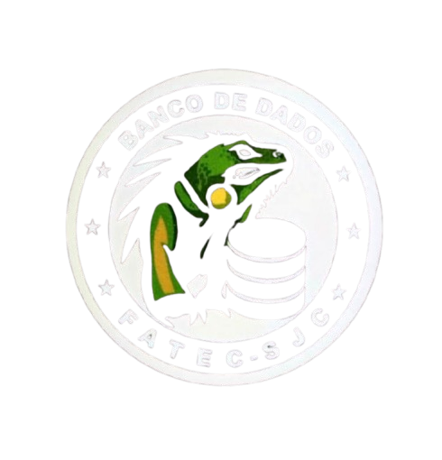

# Infomasters

# 🧮 Projeto: Sequências Lógicas em VisuAlg

Projeto educacional implementado em **VisuAlg** com o objetivo de demonstrar e calcular diferentes tipos de **sequências lógicas** (como Fibonacci, fatoriais, etc.) usando estruturas de repetição.

---

## 📑 Índice

0. [Descrição do Desafio](#Descrição-do-desafio)
1. [BackLog do Produto](#BackLog-do-Produto)
2. [Pré-requisitos](#pré-requisitos)
3. [Instalação e Uso](#instalação-e-uso)
4. [Estrutura do Código](#estrutura-do-código)
5. [Contribuição](#contribuição)

---

---

## 0. ✨ Descrição do Desáfio

### Números primos:

O maior desafio aqui é criar e validar uma função auxiliar ÉPrimo(N) eficiente. O cálculo do N-ésimo termo não é direto (não há uma fórmula simples); exigirá um laço de repetição (iteração) até que o contador de primos atinja a posição N.

### Sequência Geométrica:

Requer a implementação precisa da fórmula An = A1 * Q ^ (N - 1) com atenção especial ao tratamento das entradas do termo inicial (A1), do índice (n) e da razão (Q)

### Sequência de Cubo: 

Cubos, Quadrados Perfeitos, Triângulos Perfeitos: Estas sequências são as mais ligadas à aplicação em áreas. O desafio é garantir o cálculo correto do N-ésimo termo e, em seguida, gerar os 50 termos seguintes para permitir uma análise de projeção ou continuidade do padrão. Isso exige um laço de repetição com limite fixo.

---

## 1. ✨ BackLog do Produto

O projeto oferece a demonstração e o cálculo das seguintes sequências (adicione ou remova itens conforme o seu projeto):

* Geração de **Sequência de Números Primos** a partir do N-ésimo termo.
* Cálculo de **Sequência de Cubos** para ajudar em calculo areas a partir do N-ésimo termo, e os 50 seguintes.
* Cálculo de **Sequência Geométrica**  a partir do N-ésimo termo.
* Geração de **Sequência Alternada** a partir do primeiro termo, utilizando (+/-) fornecido pelo usuario.
* Cálculo de **Sequência de Fibonacci** a partir do N-ésimo termo, apresentado os próximos 50 termos.
* Cálculo de **Sequência de Triângulos Perfeitos** para ajudar no cálculo de áreas triângulares mostrando os 50 seguintes.
* Cálculo de **Sequência Fatorial** para visualizar o fatorial do N-ésimo termo da sequência.
* Cálculo de **Sequência de Quadrados Perfeitos** para ajudar no cálculo da área a partir do N-ésimo termo, mostrando os 50 termos seguintes.
* Cálculo de **Sequência de Tribonacci** a partir do N-ésimo termo, apresentando os próximos 50 termos. 

---

## 2. ⚙️ Pré-requisitos

Para executar este projeto, você precisa ter o software **VisuAlg** instalado em seu computador.

* [**Baixe o VisuAlg** (Link oficial ou de sua preferência)](https://sourceforge.net/projects/visualg30/I)

---

## 3. 🚀 Instalação e Uso

Como o projeto é um arquivo de algoritmo (`.alg`) do VisuAlg, o processo é simples:

1.  **Clone o repositório** para a sua máquina:
    ```bash
    git clone [https://github.com/seuusuario/nome-do-projeto.git](https://github.com/seuusuario/nome-do-projeto.git)
    ```
2.  **Abra o VisuAlg:** Inicie o software VisuAlg.
3.  **Abra o arquivo do projeto:**
    * No VisuAlg, vá em `Arquivo` -> `Abrir`.
    * Navegue até a pasta que você clonou e selecione o arquivo principal (`calculadora_sequencias.alg` ou o nome que você usou).
4.  **Execute o Algoritmo:**
    * Pressione **F9** ou clique no botão de **"Executar"** (o ícone de 'play').
5.  **Interaja:** Siga as instruções que aparecerem na tela de execução do algoritmo.

---

## 4. 📝 Estrutura do Código

O código principal está contido no arquivo:

* `[MENU.alg]`


---
## 5. Contribuição

### Pacer_Sprint_1:

#### Tabela 1: Métricas de Inspeção Diária/Revisão:

<table>
  <thead>
    <tr>
      <th align="left">Métrica Adaptada</th>
      <th align="left">Objetivo para o Sprint 1</th>
      <th align="left">Como Avaliar (Inspeção Diária/Revisão)</th>
    </tr>
  </thead>
  <tbody>
    <tr>
      <td align="left"><strong>Taxa de Cumprimento do Compromisso</strong></td>
      <td align="left">Alcançar <strong>100%</strong> de conclusão das User Stories de Alta Prioridade (Primos, Cubos, Geométrica).</td>
      <td align="left">Ao final do Sprint, divida o número de <em>User Stories</em> concluídas (que atendem à DoD) pelo número total comprometido (3).</td>
    </tr>
    <tr>
      <td align="left"><strong>Burn-Down da Tarefa</strong></td>
      <td align="left">O trabalho restante deve mostrar uma <strong>descida constante</strong> ao longo da duração do Sprint.</td>
      <td align="left"><strong>Diariamente:</strong> Registre e visualize a quantidade de tarefas técnicas restantes. Se a linha não descer, um impedimento está ativo.</td>
    </tr>
    <tr>
      <td align="left"><strong>Ritmo de Tarefas</strong></td>
      <td align="left">Concluir as tarefas em <strong>lotes pequenos e diários</strong>, evitando acumulação para os últimos dias do Sprint.</td>
      <td align="left">Ao final do Sprint, verifique se a maior parte das <strong>9 tarefas técnicas</strong> detalhadas foi concluída de forma estável e não em um pico de esforço no final.</td>
    </tr>
  </tbody>
</table>

#### Tabela 2: Métricas de Sprint Review:

<table>
  <thead>
    <tr>
      <th align="left">Métrica Adaptada</th>
      <th align="left">Objetivo para o Sprint 1</th>
      <th align="left">Como Avaliar (Sprint Review)</th>
    </tr>
  </thead>
  <tbody>
    <tr>
      <td align="left"><strong>Sucesso da Meta do Sprint</strong></td>
      <td align="left">A Meta do Sprint foi atingida? (O núcleo de sequências complexas está funcional e aceita inputs).</td>
      <td align="left"><strong>Sim/Não:</strong> Durante a Sprint Review, a funcionalidade de Primos, Cubos e Geométrica foi demonstrada com sucesso e aceitou entradas variáveis.</td>
    </tr>
    <tr>
      <td align="left"><strong>Atendimento à DoR/DoD</strong></td>
      <td align="left">Todos os Critérios da DoR (Entradas/Testes de Caso) foram respeitados e os Critérios da DoD (Funcionalidade, Testes) foram atendidos.</td>
      <td align="left">Para cada User Story: o código funciona com os <strong>Dados de Teste Mínimos</strong> e está devidamente <strong>comentado em VisuAlg</strong>?</td>
    </tr>
  </tbody>
</table>

#### Tabela 3: Métricas Pós-Sprint (Retrospectiva/Aceitação):

<table>
  <thead>
    <tr>
      <th align="left">Métrica Adaptada</th>
      <th align="left">Objetivo para o Sprint 1</th>
      <th align="left">Como Avaliar (Pós-Sprint)</th>
    </tr>
  </thead>
  <tbody>
    <tr>
      <td align="left"><strong>Taxa de Defeitos Encontrados</strong></td>
      <td align="left">O ideal é <strong>Zero</strong> defeitos críticos.</td>
      <td align="left">Conte quantos <em>bugs</em> ou erros lógicos <strong>não</strong> foram detectados durante o desenvolvimento e só surgiram após a Sprint Review ou em testes de aceitação posteriores.</td>
    </tr>
    <tr>
      <td align="left"><strong>"Refatoração" Necessária</strong></td>
      <td align="left">O código precisa ser refeito no próximo Sprint para funcionar?</td>
      <td align="left">Avalie, durante a Retrospectiva, se o código do Sprint 1 é <strong>claro</strong>, <strong>eficiente</strong> e <strong>fácil</strong> de ser usado como base para novas funcionalidades no Sprint 2 (Fibonacci, etc.).</td>
    </tr>
  </tbody>
</table>

#### Tabela de Tarefas Técnicas:

<table>
  <thead>
    <tr>
      <th align="center">Rank</th>
      <th align="left">Tarefa Técnica (O COMO)</th>
      <th align="left">Dev Sugerido</th>
      <th align="left">Status Inicial</th>
      <th align="left">Branch de Trabalho</th>
    </tr>
  </thead>
  <tbody>
    <tr>
      <td align="center"><strong>1</strong></td>
      <td align="left">1.1. Rascunhar e validar a lógica da função auxiliar <strong>ÉPrimo(N)</strong>.</td>
      <td align="left">Dev Líder</td>
      <td align="left">A Fazer</td>
      <td align="left"><code>feature/calculo-primos</code></td>
    </tr>
    <tr>
      <td></td>
      <td align="left">1.2. Implementar a iteração para encontrar o <strong>N-ésimo primo</strong>.</td>
      <td align="left">Dev Líder</td>
      <td align="left">A Fazer</td>
      <td align="left"><code>feature/calculo-primos</code></td>
    </tr>
    <tr>
      <td></td>
      <td align="left">1.3. Adicionar o bloco de código para aceitar o <strong>Termo Inicial</strong>.</td>
      <td align="left">Dev Líder</td>
      <td align="left">A Fazer</td>
      <td align="left"><code>feature/calculo-primos</code></td>
    </tr>
    <tr>
      <td align="center"><strong>2</strong></td>
      <td align="left">2.1. Implementar o algoritmo para calcular e exibir o termo na posição N ($n^3$).</td>
      <td align="left">Dev Auxiliar</td>
      <td align="left">A Fazer</td>
      <td align="left"><code>feature/calculo-cubos</code></td>
    </tr>
    <tr>
      <td></td>
      <td align="left">2.2. Adicionar o laço de repetição para calcular e exibir os <strong>50 termos seguintes</strong>.</td>
      <td align="left">Dev Auxiliar</td>
      <td align="left">A Fazer</td>
      <td align="left"><code>feature/calculo-cubos</code></td>
    </tr>
    <tr>
      <td></td>
      <td align="left">2.3. Executar o teste de validação para um N conhecido e conferir os 50 termos.</td>
      <td align="left">Dev Auxiliar</td>
      <td align="left">A Fazer</td>
      <td align="left"><code>feature/calculo-cubos</code></td>
    </tr>
    <tr>
      <td align="center"><strong>3</strong></td>
      <td align="left">3.1. Implementar o algoritmo de P.G. no VisuAlg (fórmula $a_n = a_1 \cdot q^{n-1}$).</td>
      <td align="left">Dev Líder</td>
      <td align="left">A Fazer</td>
      <td align="left"><code>feature/calculo-geometrica</code></td>
    </tr>
    <tr>
      <td></td>
      <td align="left">3.2. Configurar a entrada de dados para $a_1$, N e a constante/razão $q$.</td>
      <td align="left">Dev Líder</td>
      <td align="left">A Fazer</td>
      <td align="left"><code>feature/calculo-geometrica</code></td>
    </tr>
    <tr>
      <td></td>
      <td align="left">3.3. Testar a funcionalidade com diferentes cenários de razão.</td>
      <td align="left">Dev Auxiliar</td>
      <td align="left">A Fazer</td>
      <td align="left"><code>feature/calculo-geometrica</code></td>
    </tr>
  </tbody>
</table>

#### Tabela de Funções e Responsabilidades:

<table>
  <thead>
    <tr>
      <th align="left">Função/Responsabilidade</th>
      <th align="left">Responsabilidades Principais no Sprint 1</th>
    </tr>
  </thead>
  <tbody>
    <tr>
      <td align="left"><strong>Product Owner (PO)</strong></td>
      <td align="left">1. <strong>Manter o Foco:</strong> Garantir que o trabalho siga a Meta do Sprint.</td>
    </tr>
    <tr>
      <td></td>
      <td align="left">2. <strong>Refinar:</strong> Usar a DoR para preparar os itens do Sprint 2.</td>
    </tr>
    <tr>
      <td></td>
      <td align="left">3. <strong>Feedback:</strong> Participar da Sprint Review para inspecionar e fornecer feedback.</td>
    </tr>
    <tr>
      <td align="left"><strong>Scrum Master (SM)</strong></td>
      <td align="left">1. <strong>Facilitação:</strong> Garantir que o Daily Scrum aconteça e que o time siga a estratégia de branch.</td>
    </tr>
    <tr>
      <td></td>
      <td align="left">2. <strong>Remover Impedimentos:</strong> Resolver qualquer problema que bloqueie o desenvolvimento (ex: erro no VisuAlg, dúvida na lógica).</td>
    </tr>
    <tr>
      <td align="left"><strong>Desenvolvedor(a) Líder</strong></td>
      <td align="left">1. <strong>Desenvolvimento (Primos/Geométrica):</strong> Focar nos algoritmos mais complexos.</td>
    </tr>
    <tr>
      <td></td>
      <td align="left">2. <strong>Revisão:</strong> Fazer uma revisão rápida na lógica do item 2 (Cubos).</td>
    </tr>
    <tr>
      <td align="left"><strong>Desenvolvedor(a) Auxiliar</strong></td>
      <td align="left">1. <strong>Desenvolvimento (Cubos):</strong> Implementar o algoritmo mais direto.</td>
    </tr>
    <tr>
      <td></td>
      <td align="left">2. <strong>Testes:</strong> Realizar os testes manuais de todos os itens (1, 2 e 3).</td>
    </tr>
  </tbody>
</table>

#### Tabela de User Stories:

<table>
  <thead>
    <tr>
      <th align="left">User Story</th>
      <th align="left">Status do DoR</th>
      <th align="left">Tarefas (O COMO)</th>
    </tr>
  </thead>
  <tbody>
    <tr>
      <td align="left" rowspan="3">1. Sequência de Números Primos (Rank 1 - Alta)</td>
      <td align="left" rowspan="3">✅ Pronto</td>
      <td align="left">1.1. Rascunhar o algoritmo para encontrar o N-ésimo primo (função de validação de primos).</td>
    </tr>
    <tr>
      <td align="left">1.2. Implementar a função principal no VisuAlg para calcular o N-ésimo termo.</td>
    </tr>
    <tr>
      <td align="left">1.3. Implementar o laço para iniciar a sequência a partir do termo fornecido.</td>
    </tr>
    <tr>
      <td align="left" rowspan="3">2. Sequência de Cubos (Rank 2 - Alta)</td>
      <td align="left" rowspan="3">✅ Pronto</td>
      <td align="left">2.1. Rascunhar a lógica de cálculo do n-ésimo termo (n<sup>3</sup>).</td>
    </tr>
    <tr>
      <td align="left">2.2. Implementar o algoritmo no VisuAlg para calcular e exibir o N-ésimo termo.</td>
    </tr>
    <tr>
      <td align="left">2.3. Adicionar o laço de repetição para exibir os 50 termos seguintes.</td>
    </tr>
    <tr>
      <td align="left" rowspan="3">3. Sequência Geométrica (Rank 3 - Alta)</td>
      <td align="left" rowspan="3">✅ Pronto</td>
      <td align="left">3.1. Rascunhar a lógica para calcular o N-ésimo termo de uma P.G. (usando a constante/razão fornecida).</td>
    </tr>
    <tr>
      <td align="left">3.2. Implementar o algoritmo de P.G. no VisuAlg com entrada para a constante.</td>
    </tr>
    <tr>
      <td align="left">3.3. Testar o algoritmo com diferentes cenários de razão.</td>
    </tr>
  </tbody>
</table>


###### Desenvolvido com 💙 por Infomasters

### Scrum Master

- Maria Clara Farkas

[](https://www.linkedin.com/in/maria-clara-farkas-6a6b4534a)
[](mailto:maria.farkas@fatec.sp.gov.br)

### PO (Project Owner)

- Luis Gustavo Graciano 

[](https://www.linkedin.com/in/luisgustavogracianomanutencaoaeronautica)
[](mailto:luis.silva202@fatec.sp.gov.br)

## Dev Team 

- Igor Ruiz

[](https://www.linkedin.com/in/igor-ruiz-a56a1b30b)
[](mailto:igor.ruiz@fatec.sp.gov.br)

- Breno Cefas

[](https://www.linkedin.com/in/breno-cefas-7aa909271)
[](mailto:Breno.santos32@fatec.sp.gov.br)

- Vitor Trajai

[](https://www.linkedin.com/in/vitor-trajai-1b5393387)
[](mailto:vitor.ribeiro31@fatec.sp.gov.br)

- João Medeiros

[][(https://www.linkedin.com/in/jvmedeiros)]
[](mailto:joao.gallina@fatec.sp.gov.br)
